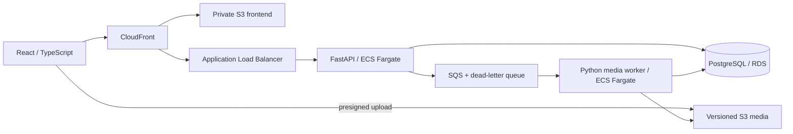

# InstaDescribe — Audio Description & AWS Cloud Core

[](https://github.com/AndriiArtemenko3/instadescribe-cloud-public/actions/workflows/ci.yml)
[](LICENSE)

InstaDescribe is an AI-assisted audio-description application for video.

This repository is a preserved public snapshot of the original product and its
AWS cloud architecture. The active InstaDescribe R&D codebase is maintained privately.

**Snapshot:** source tag `v0.1.0-cloud-core`, commit
`133992307deebdb339786bfbce3bca6714ebd808` (10 August 2026).
This repository starts a fresh history; the application and infrastructure code are
preserved from that version. See [snapshot provenance](docs/PUBLIC_SNAPSHOT.md).

**Availability:** historically validated on AWS; published here as inspectable code
with a local fixture demo. No working live AWS demo is promised. At the snapshot
preparation check on 22 September 2026, the historical frontend returned HTTP 200
and API readiness returned HTTP 503. No infrastructure was restored for publication.

## What it does

- Drafts audio descriptions from video frames, with a human editor retaining control.
- Supports scene editing, character consistency and dialogue/timing checks.
- The original local pipeline supports ASR/VAD, TTS and FFmpeg audio/video export.
- The cloud path supports direct upload, asynchronous analysis, artifact delivery
  and persisted scene edits. Cloud TTS, Smart Fill and final export are not implemented
  in this snapshot.

## Architecture



PostgreSQL owns job state and scene overrides; S3 owns media and versioned artifacts;
SQS transports work. The cloud worker adapts the existing media pipeline rather than
replacing it. [Architecture details](docs/architecture.md) ·
[Cloud release evidence](docs/releases/v0.1-cloud-core.md)

## Engineering highlights

- Constrained direct-to-S3 uploads and version-pinned artifact manifests.
- Explicit job states, atomic claims and duplicate-message handling; successful
  persistence is separate from SQS acknowledgement.
- Separate API/worker containers, shared typed queue contracts and Alembic migrations.
- Worker subprocess boundaries, media validation and bounded processing attempts.
- Terraform-defined infrastructure, scoped IAM roles, managed secrets, health checks
  and a migration-before-service deployment sequence.

Review entry points: [`services/api`](services/api), [`services/worker`](services/worker),
[`migrations`](migrations), [`infrastructure/terraform/portfolio`](infrastructure/terraform/portfolio)
and [`App/src`](App/src).

## Technology stack

Python · TypeScript · React/Vite · FastAPI · Flask (local legacy server) · SQLAlchemy /
Alembic · PostgreSQL · FFmpeg · VAD/ASR · model-provider adapters · Docker · Terraform ·
AWS S3, SQS, ECS Fargate, ECR, RDS, ALB, CloudFront, IAM, Secrets Manager and CloudWatch.

## Historical AWS validation

The August 2026 [release evidence packet](docs/releases/v0.1-cloud-core.md) records:

- an upload-to-editor journey using AWS infrastructure and deterministic vision;
- one bounded GPT-4.1 run on a rights-cleared 60-second clip, producing five scenes;
- version-pinned artifact delivery, persisted edits and duplicate-message handling;
- runtime commit and container-image digests, test records and explicit limitations.

These are historical records, not a claim of current availability, customer adoption
or production scale. The recorded deployed runtime was `2b10135`; the later source
tag includes the evidence documentation. Deployment was manual, not automated CD.

## Running locally

Prerequisites: **Node.js 22.19+**, npm, and Git. Python paths require **Python 3.12**;
cloud integration requires Docker Compose. Full media processing also needs FFmpeg
and provider/model dependencies.

```bash
git clone https://github.com/AndriiArtemenko3/instadescribe-cloud-public.git
cd instadescribe-cloud-public
```

**Fastest review: fixture demo, no keys or backend**

```bash
cd App
npm ci
npm run demo
```

Open the printed local URL (normally `http://localhost:4173`). Model/media outputs
are pre-generated fixtures: this demonstrates the editor, not live inference.

**Local processing and local cloud services:** follow the separate commands in
[Local setup](docs/LOCAL_SETUP.md). Those paths have different backends and requirements;
no AWS account or deployment is needed for the fixture demo or LocalStack tests.

**Frontend checks** (from `App`):

```bash
npm test
npm run build
npm run build:cloud
```

[CI](.github/workflows/ci.yml) targets `main` and checks Python, the API with
PostgreSQL/LocalStack, and the frontend. See [snapshot verification](docs/PUBLIC_SNAPSHOT.md)
for the distinction between fresh checks and historical test records.

## Known limitations

- Portfolio-token access control only: no user-account or multi-tenant isolation system.
- v0.1 has no worker leases/heartbeats or comprehensive crash recovery.
- Single-worker, single-AZ evidence environment; no high-availability claim.
- CloudFront-to-ALB transport is HTTP in this configuration, not end-to-end TLS.
- Terraform uses local state; deployment is manual. Never commit state or real secrets.
- The legacy Flask server is unauthenticated and must not be exposed publicly.
- Historical dependencies are preserved, including documented
  [dependency-audit debt](docs/cloud-migration/g10-frontend-dependency-audit.md).
- This is a portfolio snapshot, not a production-ready or commercially deployed SaaS.

MIT-licensed source; see [LICENSE](LICENSE). The Sintel fixture is © Blender Foundation,
CC BY 3.0; see [third-party notices](THIRD_PARTY_NOTICES.md).
