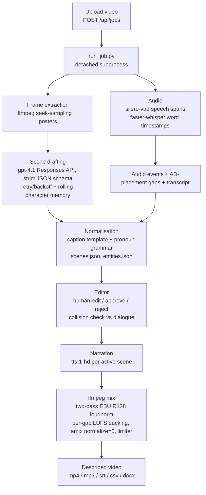
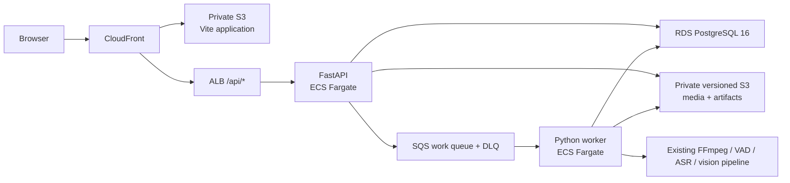

# Architecture

InstaScribe now has two deliberate deployment shapes around the same core pipeline:

- **AWS Cloud Core v0.1:** React/Vite, FastAPI, PostgreSQL, private S3, SQS and
  bounded ECS Fargate workers. This is the deployed asynchronous portfolio path.
- **Legacy/local full workflow:** one Flask process serves the React build, local
  project files, video and the JSON API, and launches the pipeline per upload. This
  remains the broader local path for Smart Fill, TTS preview and final export.

The cloud migration adapts the existing AI/media pipeline rather than changing its
prompts or authoring behavior.

## Pipeline

Each stage writes plain JSON to the project directory, so the editor reads static
files and the API stays thin.

## Model providers

The three model-backed stages (vision drafting, Smart Fill rewrite, TTS) call a
small interface in `modular_pipeline/providers/`, never a vendor SDK. A factory
selects the backend at runtime from `INSTASCRIBE_BACKEND` (or the per-capability
`VISION_PROVIDER` / `TEXT_PROVIDER` / `TTS_PROVIDER`): `openai` (default),
`anthropic` (Claude), `gemini`, `local` (Ollama for vision + text, Kokoro for
TTS), or `fake` (deterministic, keyless — used by the tests and the demo).
Swapping a model is a config change. The mermaid
above shows the default OpenAI path; setup and the quality tradeoff of the local
models are in [local-models.md](./local-models.md).

## AWS Cloud Core v0.1

The browser asks FastAPI to create a project/job and receives a constrained
presigned POST. Media travels directly to private S3 rather than through the API.
After explicit upload completion, the API verifies and pins the source identity,
persists the durable state and publishes one strict message contract to SQS.

The worker receives at most one message at a time, claims the PostgreSQL row with a
conditional transition, downloads the exact versioned source, validates it with
`ffprobe`, runs the existing pipeline in an isolated temporary workspace and uploads
deterministically named artifacts. Artifact upserts and the final
`READY_FOR_REVIEW` transition commit in one transaction; the SQS message is deleted
only after that commit. Duplicate delivery is expected and terminal duplicates do not
rerun the pipeline.

The editor obtains a short-lived manifest whose references are resolved from artifact
rows rather than reconstructed object keys. Objects stay private, responses use
`private, no-store`, and video playback uses version-pinned signed Range requests.
Scene edits are atomic PostgreSQL upserts, so they survive API task replacement.

Cloud v0.1 is intentionally bounded: one small API task, worker desired count zero
outside controlled jobs and a maximum of one 2-vCPU/8-GiB worker. Terraform defines
the environment, but deployment is still plan-gated and manual. The shared portfolio
token is access control rather than tenant authentication. Full reliability,
autoscaling, cloud TTS/export parity and CI/CD are v0.2 work.

## Legacy/local single-origin serving

The Flask server (`modular_pipeline/server.py`) serves four things from one origin:
the compiled SPA from `App/dist`, per-project data under `/data`, source videos under
`/videos`, and the JSON API under `/api`. This keeps deployment to one container and
removes cross-origin configuration. The Dockerfile copies the pipeline, the built
frontend, and the bundled sample into a single `python:3.12-slim` image with ffmpeg.

## Overlays: study mode and demo mode

The normal app, the research study, and the public demo share one codebase through a
build-time flag rather than a fork.

- **Study mode** (`VITE_STUDY_MODE=1`) bypasses login, provisions an isolated per-
  participant copy of a frozen clip, logs interaction events, and replaces export with
  an eyes-closed preview. Used to run the 10-participant evaluation.
- **Demo mode** (`VITE_DEMO_MODE=1`) serves a fully pre-baked sample: every step that
  would call OpenAI or render with ffmpeg returns committed canned data instead. The
  build ships as a static SPA with no API key, so the public demo costs nothing to run
  and has nothing to break.

Both gate on a small flag check in the client and a few branch points, leaving the
production path untouched.

## Engineering notes

- **Concurrency correctness.** The legacy path uses per-job locks plus atomic
  temp-file writes for the shared scene-override file. Cloud Core uses conditional
  PostgreSQL state transitions, a one-compute-active-job partial index and atomic
  per-field scene-override upserts. A semaphore caps simultaneous legacy ffmpeg
  renders; the cloud worker is capped at one task in v0.1.
- **Loudness.** The mix targets broadcast loudness with two-pass EBU R128
  normalisation, ducks the background per gap by measured LUFS, and uses a single
  summing `amix` with `normalize=0` plus a limiter, so narration sits cleanly over the
  bed instead of being averaged down.
- **Character memory.** Identities established in one chunk of frames carry forward via
  a rolling memory, and a rename re-renders every dependent scene through a pronoun-
  aware caption template so the narration stays grammatical.
