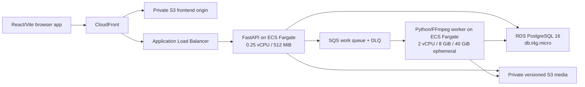
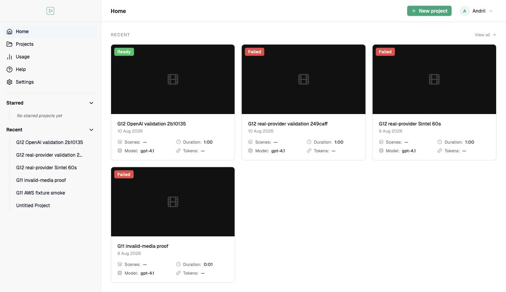
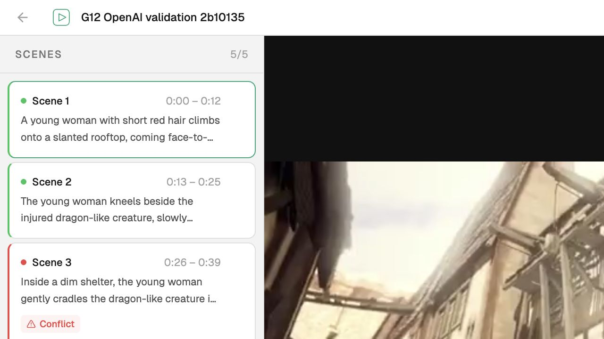

# InstaScribe v0.1 Cloud Core — release evidence packet

**Historical validation date:** 10 August 2026. This packet records the original
bounded AWS validation; it is not a current service-status report.

**Source tag:** `v0.1.0-cloud-core` (created in the source repository).
**Source snapshot commit:** `133992307deebdb339786bfbce3bca6714ebd808`.
**Recorded deployed runtime/image commit:** `2b10135b212ded8fef61ae6a5f6dcb5ad0cbc86c`.
The later snapshot commit contains this evidence packet, not a new deployed runtime.

**Region:** `eu-west-2`.
**Current availability:** no live demo is promised by this public snapshot.
On 22 September 2026, the historical frontend returned HTTP 200 and API readiness
returned HTTP 503. Historical operating-state statements below refer to the original
validation window only. No AWS infrastructure was restored for publication.

## Release verdict

The v0.1 Cloud Core milestone passed. InstaScribe's existing multimodal pipeline is
deployed as a bounded AWS application with direct private uploads, durable relational
state, queued container processing, manifest-driven artifact delivery and persisted
human edits. One single-attempt GPT-4.1 validation on a rights-cleared 60-second clip
reached `READY_FOR_REVIEW` and rendered five scenes in the live editor.

The environment is deliberately cost-controlled after validation: the API remains at
one task, the 2-vCPU/8-GiB worker is at zero, both task definitions are in deterministic
fake mode and no deployed task can read the stored OpenAI value.

This is a portfolio cloud release, not a claim of production-grade SaaS operation.

## Deployed architecture



Operational ownership is explicit:

- PostgreSQL owns projects, processing jobs, state transitions, artifacts and scene
  overrides.
- S3 owns source media, generated JSON and posters; clients receive constrained,
  expiring signed operations.
- SQS transports at-least-once work; it is not the durable business-state store.
- The worker executes the existing FFmpeg/VAD/ASR/multimodal pipeline in an isolated
  workspace and commits artifacts before acknowledging success.
- Terraform defines the single bounded environment. Deployment was manual and
  plan-gated; automated CI/CD is deferred.

The CloudFront viewer uses the AWS default domain/certificate. `/api/*` is uncached
and forwarded to the ALB with a secret origin-verification header. The accepted v0.1
origin leg is HTTP and ALB ingress is restricted to the AWS-managed CloudFront
origin-facing prefix list; custom-domain HTTPS origin transport is deferred.

## Immutable release evidence

Both ECR images used the full 40-character release commit as their immutable tag; no
`latest` tag was used.

| Image | Registry manifest digest |
|---|---|
| API | `sha256:a16dcbcea0454fb95b8d21c2042ba22c73bd6cba25103067f33455c46b935991` |
| Worker | `sha256:6d115d3ab8f07b96b1a5ef7f61fa3918517000f463f35b69f2860755f494047b` |

The final safe-restoration plan SHA-256 was
`f38cfecd0250d26ac010860a755ed976f5db6fff525e0fa80fcd9b94f9b432b5`.
The plan itself remains ignored because it contains sensitive infrastructure data.

## Accepted user journeys

### G11 — deterministic cloud proof

Real AWS S3, SQS, ECS Fargate, RDS PostgreSQL, CloudFront and FastAPI completed the
upload-to-editor journey with fake vision but real FFmpeg, VAD, transcription and
pipeline orchestration. Evidence included:

- direct browser upload to private S3;
- durable enqueue and background claim;
- `READY_FOR_REVIEW` at 100%;
- checksum-, type- and size-verified manifest artifacts;
- HTTP 206 signed video Range delivery;
- duplicate SQS delivery acknowledged without a second pipeline run;
- one canonical edit persisted through API replacement;
- invalid media rejected before model work;
- queues empty and worker zero after the window.

See [G11 AWS cloud smoke](../cloud-migration/g11-aws-cloud-smoke.md).

### G12 — bounded OpenAI proof

One explicitly authorized job processed a 60.083-second rights-cleared input with
OpenAI GPT-4.1 and one allowed attempt. It reached `READY_FOR_REVIEW`, loaded in the
editor and produced:

- five canonical scenes;
- 10,943 input tokens;
- 1,568 output tokens;
- 12,511 total tokens;
- nine checksum-, size-, content-type- and private-cache-verified artifacts;
- version-pinned HTTP Range delivery for the source video.

The full submission-to-validation interval was approximately 410.2 seconds. First
observed processing to terminal state was approximately 90.6 seconds. The initial
interval includes manual worker enablement/startup and is not an autoscaling or
model-only latency claim.

At the standard GPT-4.1 prices checked on 2026-08-10, the measured token counts imply
an estimated **$0.03443** model charge if all input was billed uncached. This is not
an invoice or total historical OpenAI spend. See
[G12 real-provider validation](../cloud-migration/g12-real-provider.md).

## Test and build record

Release-tree verification was green:

| Gate | Result |
|---|---:|
| Root Python tests | 109 passed |
| Worker/PostgreSQL/LocalStack tests | 218 passed |
| Zero-duration normalization tests | 12 passed |
| Terraform tests | 19 passed |
| Frontend Vitest | 194 passed across 19 files |
| Ruff | clean |
| TypeScript forced project build | passed |
| ESLint | 0 errors; 1 pre-existing hooks warning |
| Vite production build | passed |
| Vite cloud build | passed |
| Vite demo build | passed |
| Demo preview `/`, `/tutorials`, fixture JSON and fixture video | HTTP 200 |
| Production dependency audit triage | 15 records; 0 critical; deployed static/server surfaces classified |

The only frontend build observations were the existing React Hooks warning and
Vite's bundle-size warning. Neither was introduced by the evidence packet.
The registry audit remains nonzero; its runtime-versus-tooling analysis and required
follow-up are recorded in the
[G10 frontend dependency-audit triage](../cloud-migration/g10-frontend-dependency-audit.md).

## Measurements

| Measurement | Result | Interpretation |
|---|---:|---|
| Local 120-second worker peak | about 6.57 GiB | 4 GiB failed; 8 GiB became the evidence-based v0.1 floor |
| Local representative 299-second worker peak | 6.56 GiB | one codec/content case only; not broad five-minute coverage |
| Representative 299-second local wall time | 310 seconds | amd64 emulation with fake vision, real media/ASR path |
| Native G11 worker startup | about 85 seconds | bounded manual enablement, not autoscaling |
| G12 submission to validated output | about 410.2 seconds | includes manual worker enablement/startup |
| G12 processing observed to terminal | about 90.6 seconds | pipeline interval, not model-only latency |
| G12 model tokens | 12,511 | exact system-information artifact total |
| G12 estimated GPT-4.1 model charge | $0.03443 | published standard rates; not an invoice |

The pre-apply AWS planning model rounded the worker-off/API-on environment to about
$0.091/hour and the worker increment to about $0.1434/task-hour. A USD 25 Budget is
configured as an alert, not a spending cap. Actual AWS invoice totals are not claimed.

## Final safe operating posture

A final read-only audit after evidence capture established:

- API: one desired, one running, zero pending, ready;
- worker: zero desired/running/pending;
- both task definitions: provider `fake`, duration limit 300 seconds, three attempts;
- API and worker OpenAI secret references: zero;
- conditional worker OpenAI secret-read policy: absent;
- work queue and DLQ: zero visible, in-flight and delayed messages;
- public `/api/readyz`: HTTP 200 with the exact ready response.

The OpenAI secret value remains stored out of band but is inaccessible to the
deployed fake-mode tasks.

## Screenshots

### Deployed project dashboard

The latest successful validation appears as `Ready`; earlier failed validation runs
remain visible as honest audit history.



### Five-scene cloud editor

The live editor loads the real GPT-4.1 scenes and pinned source video. The UI labels
deferred Smart Fill, TTS Preview and Export functionality rather than implying parity.



Suggested demo sequence:

1. Sign in with the portfolio token without exposing it.
2. Show constrained direct upload and queued progress.
3. Show the worker stage transition during a controlled run.
4. Open the five-scene manifest-driven editor and scrub the signed video.
5. Edit one scene, refresh and show that the PostgreSQL override persists.
6. Close with the worker-at-zero cost-control posture and architecture diagram.

## Fixture licensing and keyless replay

The committed demonstration uses **Sintel**, © Blender Foundation, under
[CC BY 3.0](https://creativecommons.org/licenses/by/3.0/). The complete attribution
is in [THIRD_PARTY_NOTICES.md](../../THIRD_PARTY_NOTICES.md).

The evidence paths are intentionally distinct:

- G11 used real S3, SQS, PostgreSQL, ECS, FFmpeg, VAD and ASR orchestration with the
  deterministic fake vision provider. It did not make paid model calls.
- G12 used the real OpenAI GPT-4.1 vision path in addition to the real cloud/media
  stack. Cloud TTS and final export were not part of either gate.
- The committed demo's scene JSON, posters and `export.mp4` are pre-generated fixture
  outputs. They are not the artifacts produced by the G12 job.

Keyless browser replay:

```bash
make demo
```

Fixture checksum inventory:

```bash
shasum -a 256 \
  App/public/videos/sintel-blender-cc.mp4 \
  App/public/data/sintel-blender-cc/scenes.json \
  App/public/data/sintel-blender-cc/entities.json \
  App/public/data/sintel-blender-cc/audio_events.json \
  App/public/data/sintel-blender-cc/ad_placement_gaps.json \
  App/public/data/sintel-blender-cc/transcript.json \
  App/public/data/sintel-blender-cc/system_info.json \
  App/public/data/sintel-blender-cc/poster.jpg \
  App/public/data/sintel-blender-cc/poster.avif \
  App/public/data/sintel-blender-cc/export.mp4
```

## Known limitations

- The portfolio token is shared access control, not user authentication; listings are
  not tenant-isolated.
- The API is one task and the database is single-AZ/disposable; high availability is
  not claimed.
- Worker activation is manual and bounded. Queue-depth autoscaling/automatic
  scale-to-zero is deferred. A new upload can remain queued while the worker is zero;
  v0.1's one-day SQS retention means controlled processing must start before expiry
  or an operator must use a reviewed recovery path.
- SQS delivery is at least once. v0.1 has no leases, visibility heartbeats,
  crash-reclaim or cancellation.
- Cloud Smart Fill, TTS preview, entity rename and asynchronous final export are
  deferred; the local/fixture application retains the broader product demonstration.
- Scene overrides are atomic last-write-wins edits, not an approved/rejected review
  workflow or audit log.
- The G12 output was not evaluated by blind users or professional describers; no
  model-quality score is claimed.
- The five-minute and 250-MiB envelopes are not broadly proven across codecs,
  resolutions and content. Native peak filesystem use is unmeasured.
- CloudFront uses the AWS default certificate and an accepted HTTP origin leg to the
  ALB. No custom domain or configurable viewer TLS-policy floor is claimed.
- Deployment was controlled and manual; GitHub Actions OIDC CI/CD, Terraform remote
  state/modules, broader alarms/dashboards and complete Playwright coverage are v0.2.
- The dated npm audit remains nonzero. No deployed Node/server advisory surface was
  found, but React Router and build/CLI dependencies must be upgraded and the static
  deployment revalidated in a reviewed follow-up.
- No SaaS, customer, billing, multi-tenant, Next.js or Azure claim is supported.

## CV-safe wording

Short bullet:

> Deployed InstaScribe's multimodal audio-description workflow on AWS using FastAPI,
> PostgreSQL/RDS, S3, SQS, Docker and ECS Fargate, supporting direct video uploads,
> asynchronous processing and persisted human edits.

Evidence bullet:

> Validated a bounded OpenAI GPT-4.1 cloud job on a 60-second rights-cleared video,
> producing five reviewable scenes and checksum-verified private artifacts from
> 12,511 model tokens; disabled the 2-vCPU/8-GiB worker outside controlled runs to
> limit cost.

Do not replace `persisted human edits` with a broader `human review` claim until
approved/rejected review states and their history are implemented.

## README / portfolio wording

> InstaScribe Cloud Core is a deployed, human-controlled multimodal pipeline: a React
> client uploads video directly to private S3, FastAPI persists projects in PostgreSQL
> and enqueues work through SQS, and an ECS Fargate worker runs the existing
> FFmpeg/ASR/OpenAI pipeline before returning checksum-verified artifacts to the
> editor. A bounded 60-second GPT-4.1 validation produced five editable scenes; the
> heavy worker is disabled outside controlled runs.

## Stop gate

The evidence packet is complete. No tag, GitHub release, public-repository update,
DNS change, teardown or v0.2 implementation is authorized by this document. The next
action requires owner review and a separate instruction.
